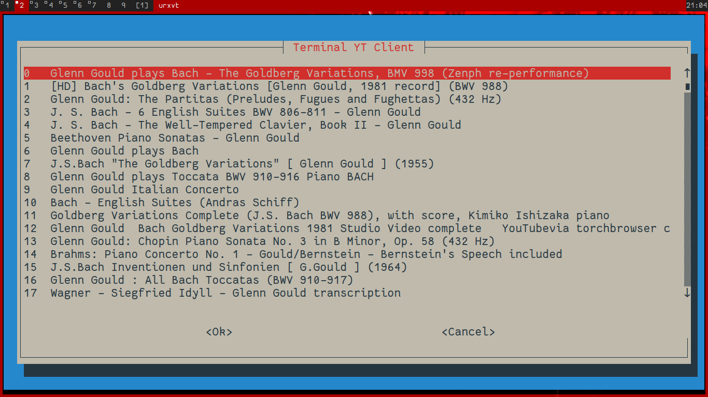

# tmyt
**Terminal youtube client**

Small script to select videos in terminal and watch them with mpv.

**Dependencies**
+ whiptail
+ mpv

**Installation**
+ wget ...
+ #ln -s /absolute/path\ to/tmyt /bin/tmyt

**Usage**
+ `tmyt search+query`
